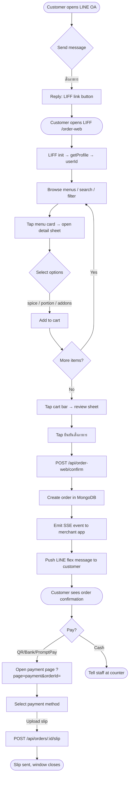
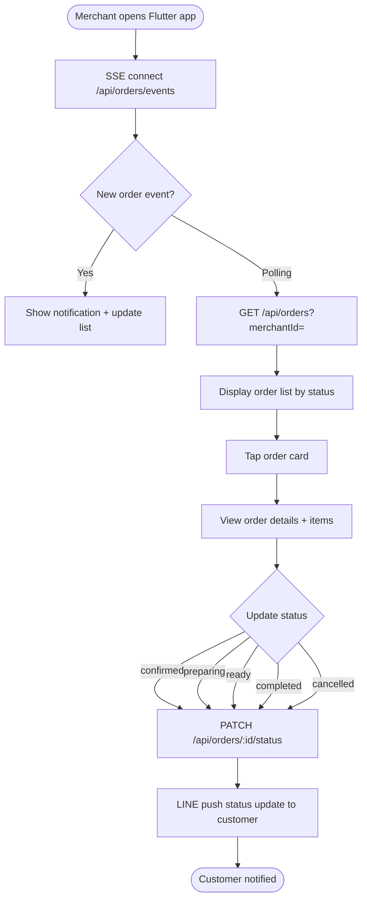
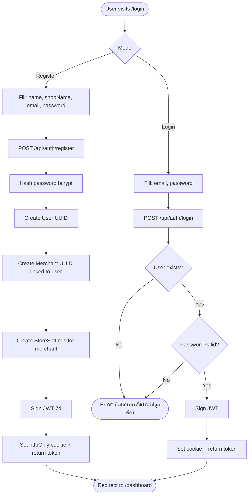
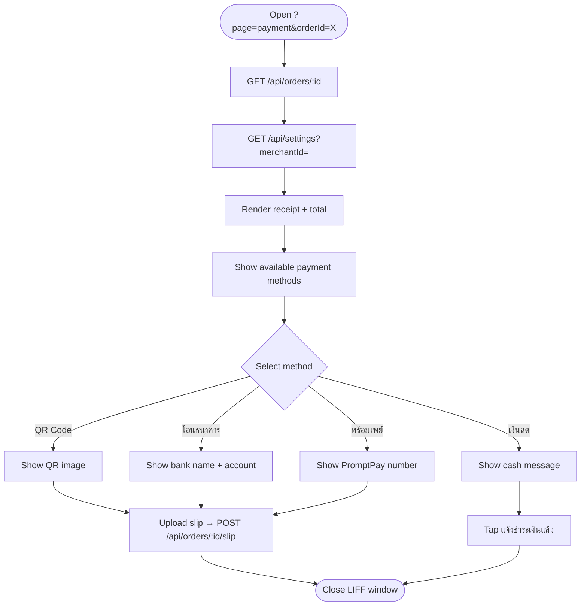
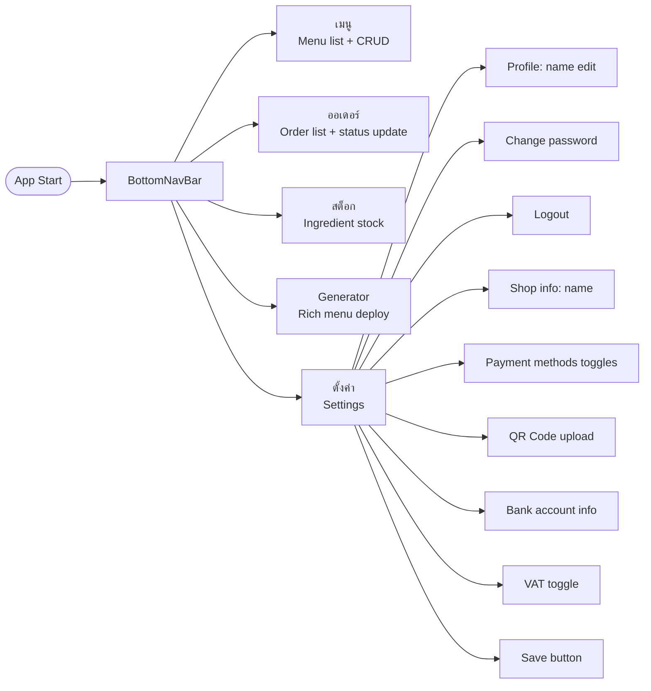

# Aihya Food — System Document & Flowcharts

> Version 1.0 | April 2026  
> Stack: Next.js 16 · Flutter · MongoDB · LINE Messaging API · Render

---

## 1. System Overview

Aihya Food is a multi-tenant food ordering platform integrated with LINE OA.  
It consists of three main components:

| Component | Tech | Role |
|---|---|---|
| **line_oa_next** | Next.js 16 (TypeScript) | API server, LIFF web app, LINE webhook |
| **line_oa_food_order** | Flutter | Merchant mobile/desktop app |
| **MongoDB Atlas** | Mongoose | Persistent data store |

---

## 2. Architecture Diagram

```
┌─────────────────────────────────────────────────────────────────┐
│                        LINE Platform                            │
│   ┌──────────────┐        ┌──────────────────────────────────┐  │
│   │  LINE Chat   │        │  LIFF Web App (order-web-app.js) │  │
│   │  (Customer)  │        │  /order-web  ?page=order/status  │  │
│   └──────┬───────┘        └──────────────┬───────────────────┘  │
└──────────┼──────────────────────────────┼────────────────────────┘
           │ Webhook                       │ fetch()
           ▼                               ▼
┌──────────────────────────────────────────────────────────────────┐
│                  Next.js API Server (Render)                     │
│                                                                  │
│  /api/webhook          /api/auth/*         /api/menus            │
│  /api/order-web/*      /api/orders/*       /api/settings         │
│  /api/broadcast/*      /api/stock          /api/rich-menu        │
│                                                                  │
│  ┌──────────────┐  ┌──────────────┐  ┌──────────────────────┐   │
│  │ order.service│  │ menu.service │  │ line.service         │   │
│  │ cart.service │  │ store_settings│  │ rich_menu.service    │   │
│  └──────┬───────┘  └──────┬───────┘  └──────────────────────┘   │
└─────────┼─────────────────┼──────────────────────────────────────┘
          │                 │
          ▼                 ▼
┌──────────────────────────────────────────────────────────────────┐
│                     MongoDB Atlas                                │
│  Collections: users · merchants · orders · menus                │
│               ingredients · storesettings                        │
└──────────────────────────────────────────────────────────────────┘
          ▲
          │ Dio HTTP + SSE
┌─────────┴────────────────────────────────────────────────────────┐
│              Flutter Merchant App                                │
│  Screens: Orders · Menus · Stock · Settings · Rich Menu          │
│  Providers: order_provider (Riverpod + SSE real-time)            │
└──────────────────────────────────────────────────────────────────┘
```

---

## 3. Database Schema

### User
```
_id          : String (UUID)
email        : String (unique, lowercase)
passwordHash : String (bcrypt)
name         : String
merchantId   : String | null  → ref: Merchant._id
createdAt    : Date
updatedAt    : Date
```

### Merchant
```
_id      : String (UUID)
ownerId  : String  → ref: User._id
name     : String
createdAt: Date
```

### StoreSettings
```
_id              : String  = merchantId
shopName         : String
acceptCash       : Boolean
acceptBankTransfer: Boolean
acceptPromptPay  : Boolean
acceptQrCode     : Boolean
bankName         : String
bankAccount      : String
accountName      : String
promptPayNumber  : String
qrCodeImageUrl   : String | null
qrCodeImageBase64: String | null
vatEnabled       : Boolean
```

### Menu
```
_id           : String (UUID)
merchantId    : String
name          : String
description   : String
price         : Number
imageUrl      : String | null
category      : String
shopType      : 'streetFood' | 'restaurant' | 'buffet'
maxSpiceLevel : Number (0 = no spice)
ingredientIds : String[]
isAvailable   : Boolean
addons        : [{ id, name, price }]
portionOptions: [{ id, name, extraPrice }]
```

### Order
```
_id                  : String (UUID)
merchantId           : String
customerId           : String (LINE userId)
customerName         : String
items                : OrderItem[]
status               : 'pending'|'confirmed'|'preparing'|'ready'|'completed'|'cancelled'
totalPrice           : Number
estimatedWaitMinutes : Number
note                 : String | null
createdAt            : Date
updatedAt            : Date
```

### Ingredient
```
_id               : String (UUID)
merchantId        : String
name              : String
quantity          : Number
unit              : String
lowStockThreshold : Number
```

---

## 4. API Reference

### Auth
| Method | Path | Description |
|---|---|---|
| POST | /api/auth/register | Register user + create merchant + store settings |
| POST | /api/auth/login | Login, returns JWT (cookie + body) |
| POST | /api/auth/logout | Clear auth cookie |
| GET  | /api/auth/me | Get current user (Bearer token or cookie) |
| PATCH| /api/auth/profile | Update display name |
| PUT  | /api/auth/profile | Change password |

### Menus
| Method | Path | Description |
|---|---|---|
| GET    | /api/menus?merchantId= | List menus |
| POST   | /api/menus | Create menu (multipart, image optional) |
| PUT    | /api/menus/:id | Update menu |
| DELETE | /api/menus/:id | Delete menu |
| PATCH  | /api/menus/:id/available | Toggle availability |

### Orders
| Method | Path | Description |
|---|---|---|
| GET   | /api/orders?merchantId= | List orders |
| GET   | /api/orders/grouped | Orders grouped by status |
| GET   | /api/orders/:id | Get single order |
| PATCH | /api/orders/:id/status | Update order status |
| GET   | /api/orders/:id/queue | Queue position + wait time |
| POST  | /api/orders/:id/slip | Upload payment slip (multipart) |
| GET   | /api/orders/events | SSE stream for real-time new orders |

### Order Web (LIFF)
| Method | Path | Description |
|---|---|---|
| POST | /api/order-web/confirm | Submit cart → create order → push LINE flex |
| GET  | /api/order-web/status?userId= | Get active orders for user |

### Settings
| Method | Path | Description |
|---|---|---|
| GET  | /api/settings?merchantId= | Get store settings |
| POST | /api/settings | Save store settings (multipart, QR image optional) |
| GET  | /api/settings/qr?merchantId= | Serve QR code image |

### Stock
| Method | Path | Description |
|---|---|---|
| GET   | /api/stock?merchantId= | List ingredients |
| POST  | /api/stock | Add ingredient |
| PATCH | /api/stock/:id | Update quantity |
| DELETE| /api/stock/:id | Delete ingredient |

### Broadcast
| Method | Path | Description |
|---|---|---|
| POST | /api/broadcast/push | Push text message to userId |
| POST | /api/broadcast/flex | Broadcast flex message to all followers |

### Rich Menu
| Method | Path | Description |
|---|---|---|
| GET    | /api/rich-menu | List all rich menus |
| POST   | /api/rich-menu/deploy/customer | Deploy customer rich menu |
| POST   | /api/rich-menu/deploy/merchant | Deploy merchant rich menu |
| DELETE | /api/rich-menu/:id | Delete rich menu |
| POST   | /api/rich-menu/reset | Reset to default |

---

## 5. Flowcharts (Mermaid — paste into Figma via Mermaid plugin)

### 5.1 Customer Order Flow (LINE Chat)



### 5.2 Merchant Order Management Flow (Flutter App)



### 5.3 Auth Flow (Register / Login)



### 5.4 LIFF Payment Flow



### 5.5 LINE Webhook Text Command Flow

```mermaid
flowchart TD
    A([Customer sends text]) --> B[POST /api/webhook]
    B --> C{Validate LINE signature}
    C -->|Invalid| D([401 Reject])
    C -->|Valid| E{Parse text}
    E -->|เมนู / menu| F[Get menus → reply flex cards]
    E -->|สั่งอาหาร| G[Reply LIFF link]
    E -->|ติดตามสถานะ| H[Get active orders → reply status flex]
    E -->|สั่ง {name}| I[Fuzzy search menu]
    I -->|Found| J[Add to in-memory cart → reply cart flex]
    I -->|Not found| K([Reply: ไม่พบเมนู])
    E -->|เพิ่ม {name}| J
    E -->|หมายเหตุ {text}| L[Update last cart item note]
    E -->|ยืนยันออเดอร์| M[Create order → clear cart → reply confirm flex]
    E -->|ยกเลิกตะกร้า| N[Clear cart]
    E -->|ดูตะกร้า| O[Reply cart or active orders]
    E -->|สถานะ #{id}| P[Find order → reply status flex]
    E -->|โปรโมชั่น| Q[Reply promotion text]
    E -->|other| R([Reply help message])
```

### 5.6 Flutter App Screen Navigation



---

## 6. Environment Variables

| Variable | Used In | Description |
|---|---|---|
| MONGODB_URI | Next.js | MongoDB Atlas connection string |
| LINE_CHANNEL_ACCESS_TOKEN | Next.js | LINE Messaging API token |
| LINE_CHANNEL_SECRET | Next.js | Webhook signature validation |
| JWT_SECRET | Next.js | JWT signing secret |
| LIFF_URL | Next.js | LIFF app URL for deep links |
| RENDER_EXTERNAL_URL | Next.js | Public base URL of the server |
| NEXT_PUBLIC_BASE_URL | Next.js | Client-side base URL |

---

## 7. Key Design Decisions

**Multi-tenant by merchantId**  
Every resource (menu, order, ingredient, settings) is scoped by `merchantId`. One user = one merchant on register.

**In-memory cart for LINE chat**  
Cart state for LINE text commands is stored in-memory (`cart.service.ts`) per `userId`. It resets on server restart. LIFF web orders bypass this and go directly to `/api/order-web/confirm`.

**SSE for real-time order push**  
The Flutter app connects to `/api/orders/events` (Server-Sent Events). When a new order is created, `emitNewOrder()` broadcasts to all connected merchant clients instantly.

**JWT in httpOnly cookie + Authorization header**  
Auth token is set as an httpOnly cookie (web) and also returned in the response body (Flutter/mobile). `getTokenFromRequest()` checks both.

**Error response standard**  
All API errors return HTTP 500 with body `{ code, en, th }` for consistent handling across web and Flutter.

---

## 8. Deployment

| Service | Platform | URL |
|---|---|---|
| Next.js API | Render (Web Service) | https://aihya-food-man.onrender.com |
| MongoDB | MongoDB Atlas | cluster0.irlbug5.mongodb.net/aihya_food |
| Flutter | Build locally → APK/Windows | `build_flutter.bat` |

---

## 9. How to Import Flowcharts into Figma

1. Install the **"Mermaid to Figma"** plugin in Figma  
   (search "Mermaid" in Figma Community plugins)
2. Open the plugin → paste any `flowchart TD` block from Section 5
3. Click **Render** → the diagram appears as Figma frames/nodes
4. Arrange and style as needed

Alternatively use **https://mermaid.live** to preview and export as SVG, then import SVG into Figma.
